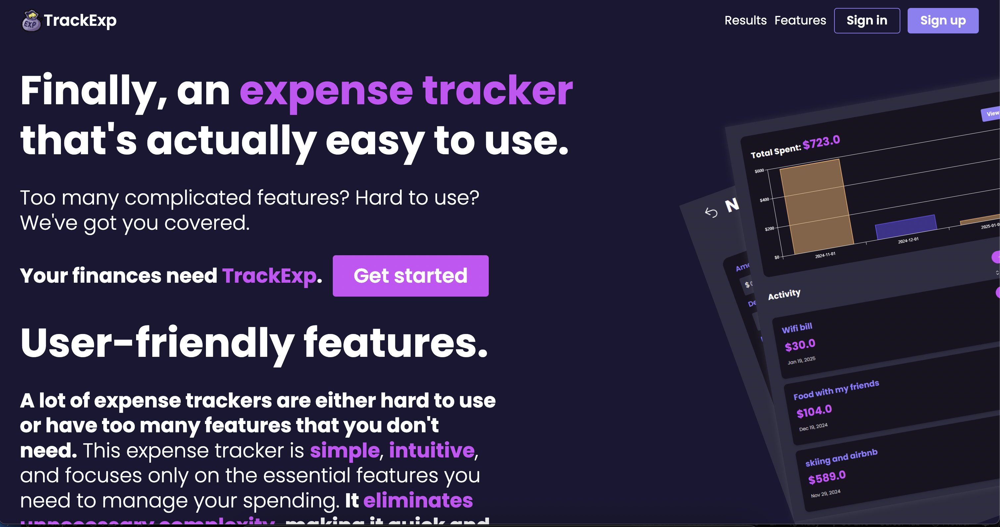
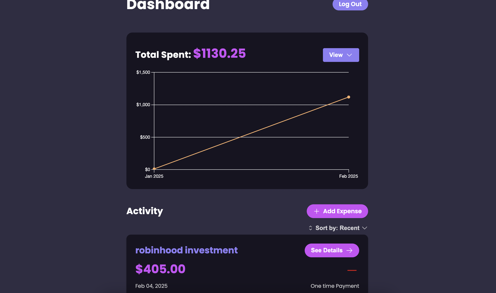
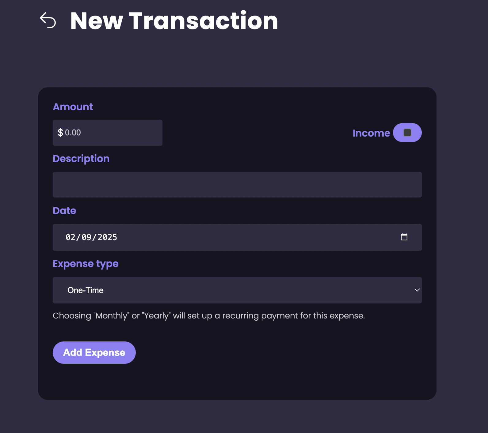

# TrackExp - Simple Expense Tracker

TrackExp is a user-friendly expense tracking application designed to eliminate unnecessary complexity while providing essential features for managing personal finances. The application focuses on simplicity and intuitive design, making it easy for users to track their expenses without feeling overwhelmed.





## Features

- 📊 Simple and intuitive dashboard
- 💰 Track both expenses and income
- 📅 Support for one-time, monthly, and yearly transactions
- 📈 Visual analytics with interactive charts
- 📱 Responsive design for mobile and desktop
- 🌙 Dark mode support
- 🔄 Recurring transaction automation with background jobs and Solid Queue

## Tech Stack

### Backend
- Ruby on Rails 8.0.1
- SQLite3
- Background job processing with Solid Queue

### Frontend
- Hotwire (Turbo & Stimulus)
- Custom CSS (No frameworks)
- Chartkick for data visualization

### Authentication & Security
- BCrypt for password hashing
- Custom session management

### Deployment
- Digital Ocean VPS
- Docker containerization
- Kamal for deployment

## Getting Started

### Prerequisites
- Ruby 3.2.0 or higher
- SQLite3
- Docker (for deployment)

### Local Development Setup

1. Clone the repository

```bash
git clone https://github.com/yourusername/trackexp.git
cd trackexp
```

2. Install dependencies
```bash
bundle install
```

3. Setup the database
```bash
rails db:create
rails db:migrate
rails db:seed  # if you want sample data
```

4. Start the development server
```bash
bin/dev
```

5. Visit `http://localhost:3000` in your browser

### Deployment

This application is configured for deployment using Docker and Kamal. To deploy:

1. Set up a VPS on Digital Ocean
2. Configure your deployment credentials
```bash
RAILS_MASTER_KEY=your_master_key
DOCKER_REGISTRY=your_registry
```

3. Deploy using Kamal
```bash
kamal setup
kamal deploy
```